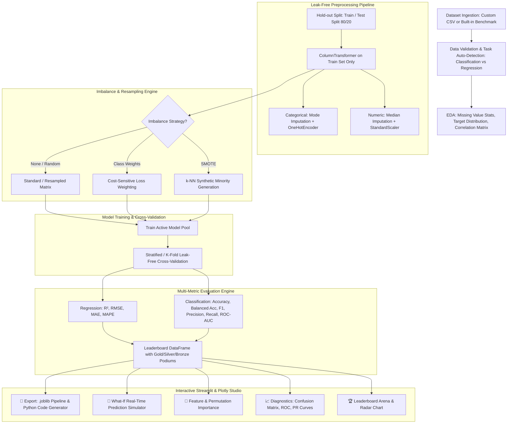

# ⚡ Machine Learning Model Comparison & Evaluation Studio
> **Author & Project Architect:** Ajeet Jain  
> **Tech Stack:** Python · Scikit-Learn · Streamlit · Plotly · NumPy · Pandas · Joblib

---

## 📌 1. Project Overview & Objective

The **ML Model Comparison Studio** is an automated, end-to-end Machine Learning benchmarking and evaluation platform designed to solve a core problem in applied data science: **rapidly training, evaluating, and diagnosing multiple supervised ML algorithms side-by-side with mathematical rigor, zero data leakage, and real-time interactive explainability.**

### 🎯 Key Capabilities:
1. **Multi-Algorithm Benchmarking**: Evaluates 8+ Classification & Regression models simultaneously.
2. **Strict Zero Data Leakage**: Enforces scikit-learn `ColumnTransformer` and `Pipeline` architectures where scalers, imputers, and encoders are fit strictly inside cross-validation folds and training sets.
3. **Robust Imbalance Handling**: Built-in zero-dependency **SMOTE (Synthetic Minority Over-sampling)**, Random Over/Under-sampling, and cost-sensitive class weighting.
4. **Interactive Plotly Visualizations**: Multi-dimensional Radar charts, interactive Confusion Matrices with normalized percentage toggles, multi-model ROC/PR curves, and Feature Importance.
5. **Interactive What-If Prediction Simulator**: Live user input controls for real-time model inference with probability confidence meters.
6. **Production Artifact Export**: One-click `.joblib` pipeline bundle serialization and auto-generated standalone Python inference scripts.

---

## 🏗️ 2. High-Level System Architecture & Workflow



---

## 🔬 3. Detailed Step-by-Step Technical Flow

### Step 1: Data Ingestion & Profiling (`src/data_loader.py`)
- Supports custom CSV file uploads with automatic encoding fallback (`utf-8` $\to$ `latin-1`).
- Includes 6 built-in benchmark datasets: **Breast Cancer**, **Wine Quality**, **Titanic (Mixed & Missing Data)**, **Iris Benchmark**, **California Housing**, and **Diabetes Progression**.
- **Task Auto-Detection**: Inspects target column data type and cardinality. If target is non-numeric or has $\le 15$ integer unique values $\implies$ **Classification**; otherwise $\implies$ **Regression**.

---

### Step 2: Leak-Free Preprocessing (`src/preprocessor.py`)
- **The Problem in Naive ML**: Fitting scalers (`StandardScaler().fit_transform(X)`) or imputers on the whole dataset before splitting leaks the test set's mean, median, and variance into training, causing artificially high test scores.
- **The Solution**: 
  - Raw features remain untouched until after the train-test split.
  - `ColumnTransformer` bundles:
    $$\text{Numerical Features} \xrightarrow{\text{SimpleImputer(median)}} \xrightarrow{\text{StandardScaler()}} \text{Scaled Matrix}$$
    $$\text{Categorical Features} \xrightarrow{\text{SimpleImputer(most\_frequent)}} \xrightarrow{\text{OneHotEncoder(handle\_unknown='ignore')}} \text{Encoded Matrix}$$
  - **Why One-Hot Encoding instead of `LabelEncoder`**: `LabelEncoder` assigns arbitrary numbers ($0, 1, 2$) which imposes false ordinal relationships ($2 > 1 > 0$) that corrupt distance-based algorithms like **Logistic Regression, SVM, and KNN**. `OneHotEncoder` creates orthogonal binary dimensions.

---

### Step 3: Imbalance & SMOTE Engine (`src/imbalance.py`)
- **Zero-Dependency SMOTE Algorithm**:
  1. For each minority sample $x_i$, finds its $k$-nearest neighbors in the minority class using Euclidean distance:
     $$NN(x_i) = \{x_{i1}, x_{i2}, \dots, x_{ik}\}$$
  2. Randomly selects a neighbor $x_{nn}$ and generates a synthetic sample:
     $$x_{\text{synthetic}} = x_i + \lambda \cdot (x_{nn} - x_i), \quad \lambda \sim U(0, 1)$$
  3. Repeats until class balance is achieved.
- **Resampling applied only on training data**: Test sets remain in their natural, un-oversampled distribution to give an honest real-world evaluation.

---

### Step 4: Model Training & Leak-Free Cross-Validation (`src/evaluator.py`)
- **Active Model Pool**:
  - *Classifiers*: Logistic Regression, Random Forest, Gradient Boosting, XGBoost, Support Vector Machine (RBF), K-Nearest Neighbors, Decision Tree, Extra Trees.
  - *Regressors*: Ridge Regression, Linear Regression, Random Forest Regressor, Gradient Boosting Regressor, XGBoost Regressor, KNN Regressor, SVR, Extra Trees Regressor.
- **Cross-Validation Loop**: Executes $k$-fold cross-validation by fitting preprocessing and resampling **inside each fold independently**, preventing cross-fold leakage.

---

### Step 5: Interactive Visualizations & Explainability (`src/visualizer.py`)
- **Leaderboard Comparison Bar Chart**: Horizontal sorted bars with dynamic metric selection.
- **Multi-Dimensional Radar Chart**: Compares 6 metrics simultaneously across all models.
- **Interactive Confusion Matrix**: Heatmap with a toggle for integer counts vs. row-normalized percentages.
- **Receiver Operating Characteristic (ROC) & PR Curves**: Overlaid multi-model curves with threshold tooltips and macro-averaged AUC.
- **Feature & Permutation Importance**: Tree feature importances for ensemble models + Permutation Importance for distance/linear models.

---

### Step 6: Live What-If Simulator & Model Serialization (`src/simulator.py` & `src/exporter.py`)
- **Live Simulator**: Dynamically inspects feature metadata to build number inputs and dropdowns, allowing real-time prediction tests with class probability confidence bars.
- **Model Serialization**: Bundles the fitted `ColumnTransformer`, trained model, and metadata into a single `.joblib` file.
- **Python Script Generator**: Generates standalone copy-paste Python code for running inference in production.

---

## 📁 4. Project Directory & Module Responsibilities

```
e:/ML DASHBOARD/
│
├── app.py                      # Main Streamlit dashboard UI, state management, and tabbed routing
├── ml_dashboard.py             # Backward compatibility entry point
├── requirements.txt            # Project dependencies (Streamlit, Scikit-Learn, Plotly, XGBoost, Joblib)
├── test_suite.py               # Automated unit tests (resampling, CV, charts, serialization)
├── ajeet.md                    # Technical architecture & project explanation (this document)
│
└── src/
    ├── __init__.py             # Package initializer (v3.1)
    ├── ui_theme.py             # Modern Light Theme design system, CSS, podiums, winner banner
    ├── imbalance.py            # Zero-dependency SMOTE, Random Oversampling, Undersampling
    ├── data_loader.py          # Benchmark datasets (Breast Cancer, Wine, Titanic, Housing) & CSV parser
    ├── preprocessor.py         # Sklearn ColumnTransformer (Imputation, OneHot, StandardScaler)
    ├── models.py               # Model registry for Classification and Regression
    ├── evaluator.py            # Leak-free cross-validation & evaluation engine
    ├── visualizer.py           # Plotly interactive charts (Radar, ROC, PR, Heatmaps, Bar charts)
    ├── simulator.py            # Live What-If inference simulator with confidence meter
    └── exporter.py             # .joblib pipeline serializer & Python inference script generator
```

---

## 💼 5. How to Put This on Your Resume

### 📝 Bullet Points for Resume:

```markdown
**Machine Learning Model Comparison & Evaluation Studio** | *Python, Scikit-Learn, Streamlit, Plotly, Joblib*
• Built an end-to-end ML benchmarking dashboard evaluating 8+ classification & regression models (XGBoost, Random Forest, SVM, Logistic Regression) with automated metric tracking.
• Engineered a leak-free preprocessing pipeline using Scikit-Learn ColumnTransformer (median imputation, standard scaling, one-hot encoding) integrated into stratified k-fold cross-validation.
• Implemented a zero-dependency k-NN SMOTE resampling engine and class-weight balancing to resolve minority class imbalance with zero test-set contamination.
• Designed an interactive data visualization suite using Plotly (Radar charts, normalized Confusion Matrices, ROC/PR curves, Feature Importance) and a real-time What-If prediction simulator.
• Developed pipeline serialization (.joblib) and automated production Python inference script generation.
```

---

## 🗣️ 6. Interview Questions & How to Answer Them

### Q1: *"What is the difference between applying StandardScaler before train_test_split vs inside a Pipeline?"*
> **Your Answer:** *"Applying `StandardScaler` to the entire dataset before splitting causes **Data Leakage**. The scaler calculates the global mean ($\mu$) and standard deviation ($\sigma$), which leaks information about the test distribution into the training set. This artificially inflates test performance. In my project, I encapsulated `StandardScaler` inside a `ColumnTransformer` and fit it strictly on `X_train`, using `transform()` on `X_test`."*

---

### Q2: *"Why did you use OneHotEncoder instead of LabelEncoder on categorical features?"*
> **Your Answer:** *"`LabelEncoder` is intended only for 1D target labels ($y$). When applied to categorical input features (like 'Red'=0, 'Green'=1, 'Blue'=2), it introduces an artificial ordinal relationship ($2 > 1 > 0$). Distance-based models like Logistic Regression, SVM, and KNN interpret 'Blue' as greater than 'Red'. `OneHotEncoder` creates orthogonal binary columns with no artificial ordering."*

---

### Q3: *"How does SMOTE work, and why should it only be applied to training data?"*
> **Your Answer:** *"SMOTE (Synthetic Minority Over-sampling Technique) creates synthetic data points along the line segment joining a minority sample and its $k$-nearest neighbors in feature space. It must **never** be applied to test or validation sets because evaluation metrics must reflect the natural, real-world class distribution."*

---

### Q4: *"How did you structure the live prediction simulator?"*
> **Your Answer:** *"Since the entire pipeline (imputer + scaler + encoder + classifier) was serialized as a single scikit-learn `Pipeline`, the simulator takes raw, un-preprocessed user inputs, converts them into a DataFrame, and passes them directly to `pipeline.predict()` and `pipeline.predict_proba()`. The preprocessor handles novel inputs automatically."*
